Una ampliació de la matèria basada en els teus interessos personals

# Què aprendràs?
L'objectiu d'aquest model és desenvolupar una recerca bibliogràfica, partint del teus interessos, que amplii aquest curs de forma invidualitzada. Per decidir la temàtica del projecte, només hi ha dues pautes:
- que tingui una connexió amb la geologia o la biologia
- que sigui una novetat (no pot ser cap del temes treballats al curs)

Per altra banda, és imprescindible definir uns **objectius concrets** pel teu projecte: aquest han de ser específics i detallats. Si trobes dificultat per definir-los, pots provar a formular una pregunta (què també ha de ser específica i detallada 😅)

```mermaid
flowchart TD
    A[Inicio] --> B[Pas1 1: Definir objectius]
    B --> C[Paso 2: Seleccionar fonts d'informació]
    C --> D[Paso 3: Elaboració del treball]
    D --> E[Fin]
```

